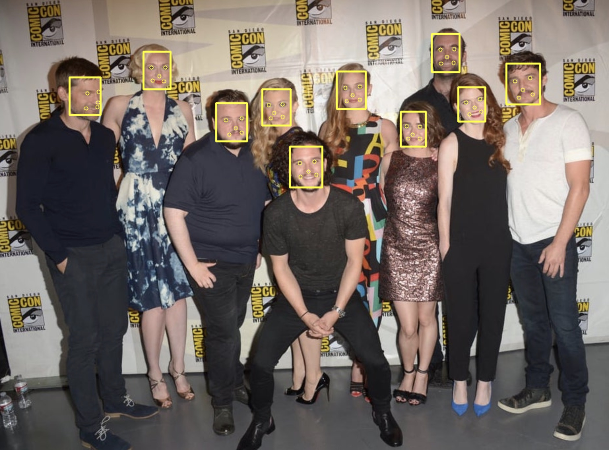
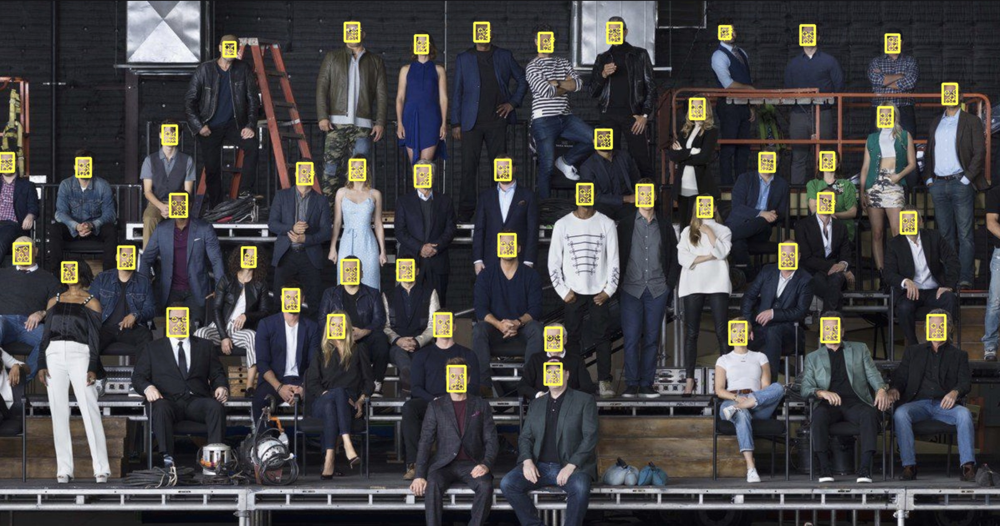

# mtcnn-opencv

No Caffe required on your machine for MTCNN inferencing with this implementation. OpenCV uses DNN module that provides the inference support. <br>

The module is capable of taking models & weights from various popular frameworks such as Caffe, tensorflow, darknet etc. <br>

More info here - https://github.com/opencv/opencv/wiki/Deep-Learning-in-OpenCV

## MTCNN

[ZHANG2016] Zhang, K., Zhang, Z., Li, Z., and Qiao, Y. (2016). Joint face detection and alignment using multitask cascaded convolutional networks. IEEE Signal Processing Letters, 23(10):1499–1503.
https://kpzhang93.github.io/MTCNN_face_detection_alignment/paper/spl.pdf


## Quickstart

### Requirements

* OpenCV 4.1+
* CMake 3.2+


## Build

```bash
git clone https://github.com/egcode/mtcnn-opencv.git
cd mtcnn-opencv
mkdir build
cd build
cmake ..
make
```


## Run

```bash
cd mtcnn-opencv

# Camera Inference example (<app_binary> <path_to_models_dir>):
./build/infer_cam ./models


# Photo Inference examples (<app_binary> <path_to_models_dir> <path_to_test_image>):

# An image with 10 human faces
./build/infer_photo ./models ./data/got.jpg 

# An image with 46 human faces
./build/infer_photo ./models ./data/marvel.jpg

```

## Results

Here is an example of how the execution of the sample application looks like




## Acknowledgments

The model files are taken from [here](https://github.com/kpzhang93/MTCNN_face_detection_alignment/tree/master/code)

10 human faces picture taken from here [here](https://www.popsugar.com/celebrity/photo-gallery/43737931/image/43738767/July-2014)

46 human faces picture taken from here [here](https://twitter.com/MarvelStudios/status/961646528610779136/photo/1?ref_src=twsrc%5Etfw%7Ctwcamp%5Etweetembed%7Ctwterm%5E961646528610779136%7Ctwgr%5E363937393b636f6e74726f6c&ref_url=https%3A%2F%2Findianexpress.com%2Farticle%2Fentertainment%2Fhollywood%2Fmarvel-cinematic-universe-ten-year-see-photo-5056933%2F)


## References
https://github.com/ksachdeva/opencv-mtcnn

https://github.com/golunovas/mtcnn-cpp